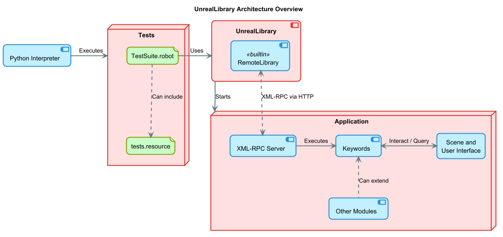
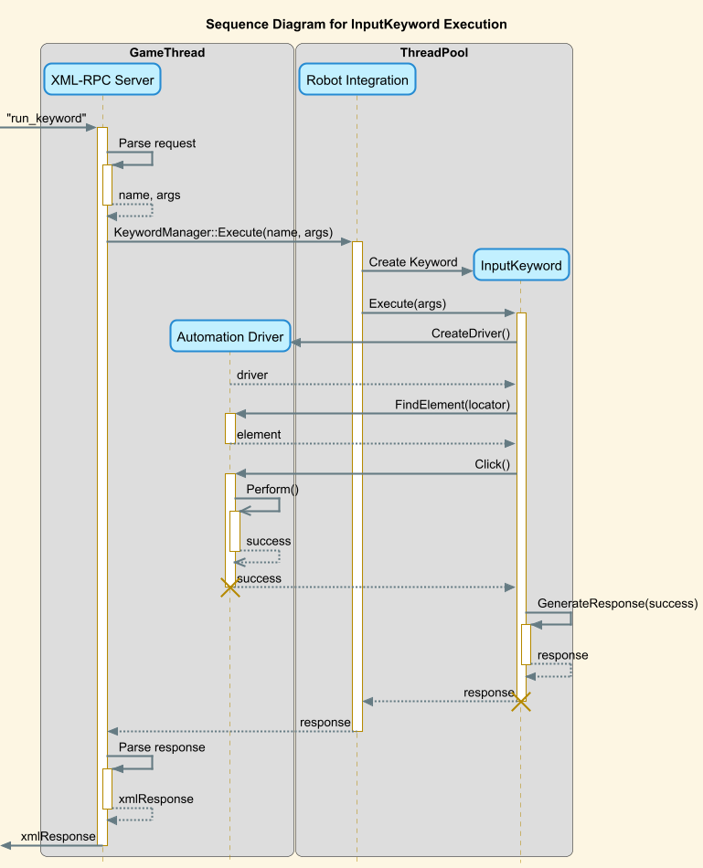

# UnrealLibrary & RobotIntegration Plugin

## Introduction

**UnrealLibrary** is a library for [Robot Framework](https://robotframework.org/), enabling the testing of Unreal Engine
Applications with Robot Framework tests.

The library consists of 2 parts:

- *UnrealLibrary*: Library for Robot Framework, responsible for starting and communicating between Robot Framework and
  the application
- *RobotIntegration Plugin*: Plugin inside the tested application, responsible for interacting with the scene and user
  interface

## Features

- Simulating user input on UI elements of an Unreal Engine applications
- Querying the state of UI and the current level
- Creating your own custom Keywords

### Planned features & ideas

- Support for tests in multiplayer
- CI/CD integration

## Installation

To install this library, download and extract or clone this repository into the `Plugins/` directory of your Unreal
Engine application.

After you have started the application, you should be able to activate the *RobotIntegration* in the Plugin Manager.

## Writing your first test

1) Create a directory for containing test files and output logs, e.g. `Tests/` in the root directory of the application
2) Install the *UnrealLibrary*: `pip install "../Plugins/RobotIntegration/Python/"`
    - This should install the UnrealLibrary, as well as the Robot Framework and its dependencies themselves
    - Use a [virtual environment](https://docs.python.org/3/library/venv.html) to separate the installation from the
      global packages
    - You can additionally install optional dependencies `dev`, providing the
      [DebugLibrary](https://pypi.org/project/robotframework-debuglibrary/) and
      a [formatter for test files](https://pypi.org/project/robotframework-tidy/)
3) Create a Test Suite:

```RobotFramework
*** Settings ***
Library    UnrealLibrary    <path/to/Application.uproject>    <path/to/engine/>

Suite Setup    Start Application
Suite Teardown    Stop Unreal Application

*** Test Cases ***
Simple Test
    Click Element    \#OpenMenu
    Element should be visible    \#Menu
    
Advanced Test
    Click Element    \#StartGame
    Sleep    2 seconds     Wait untile the Level has been loaded
    ${Level} =     Get Level Name
    Should Be Equal    ${Level}    DefaultLevel

*** Keywords ***
Start Application
    Build Unreal Application
    Start Unreal Application
```

4) Run the tests: `robot .`
5) After the tests have been run, Robot Framework will generate a `report.html`, containing an interactive detailed log
   about the execution

## Structure

In this section, we will outline the architecture of the *UnrealLibrary* and the *RobotIntegration* Plugin, their
interaction and how we can interact with the scene and user interface.



#### UnrealLibrary

The *UnrealLibrary* is the primary interface between written tests and the application. While it only provides a few
keywords itself, its primary job is to build and start the application and establishing a connection to it.

To function properly, it requires two arguments:

- The path to the `.uproject` file of the application
- The path to the root of the engine installation to use

You can also provide the paths as global variables: `UNREAL_ENGINE_PATH` and `UNREAL_APPLICATION_PATH`, which can also
be set from the commandline by adding `--variable UNREAL_ENGINE_PATH:<path/to/engine>`. The path to the engine
installation is required since building and starting the application uses the `RunUAT` script.

The *UnrealLibrary* provides the following keywords:

- **Build Unreal Application**: Builds the application in a given configuration (default: *Development*).
- **Start Unreal Application**: Starts the application (which needs to be built!) on a given port (default: *2870*) and
  path (default: */rpc*).You can provide additional argument passed to the application via the `run_args` argument.
- **Stop Unreal Application**: Kills the currently running application.
- **Run UAT**: Manually run the UAT. Requires a subcommand and optionally some arguments. Output can be redirected to a
  file. By default, this will wait until the command has finished and return the return code. But can also return
  immediately, in which case it will return the `subprocess.Popen` of the spawned subprocess.

#### RemoteLibrary

The *RemoteLibrary* is a builtin library of Robot Framework, which allows running test libraries as external processes
or even on different machines. It utilizes the [XML-RPC Protocol](https://xmlrpc.com/) to communicate with an arbitrary
process over an HTTP connection. Instead of executing an action inside the Python interpreter, it sends an RPC request
to the server, responsible for parsing the arguments to the keyword, executing the desired action and returning the
result via the HTTP response. This also means you can implement a test library other languages besides Python.

You can find more info in the [RemoteLibrary Interface Repository](https://github.com/robotframework/RemoteInterface)
or the
[Robot Framework Documentation](https://robotframework.org/robotframework/latest/RobotFrameworkUserGuide.html#remote-library-interface).

When using the *UnrealLibrary*, you do not need to initiate the *RemoteLibrary* yourself. Instead, when you start the
application with **Build Unreal Application**, it will automatically initialize and connect it as soon as the XML-RPC
Server inside the application has been started.

#### Keywords

Keywords are the fundamental building blocks of Robot Framework Tests, which can be composed to create the test cases.
Keywords are either imported from libraries or created by the user (so called user-defined Keywords).

For the *UnrealLibrary*, Keywords can be found inside the `RobotKeywords` module. They are discovered by the
`get_library_information` RPC, executed when the *RemoteLibrary* is initialized. This will make all Keywords defined
inside the application available to be called from tests.

In the *RobotIntegration* plugin, Keywords are created by deriving from the `UKeyword` class. The `DisplayName`  field
of a derived class serves as the name of the Keyword and defines the string by which it can be executed inside the test
files. Additionally, any `UPROPERTY` containing the `KeywordArgument` metadata will be automatically detected as such.
When an RPC for this Keyword is received, the Keyword will be instantiated and all arguments from the request will be
automatically parsed into the corresponding field of the instance. For more information about the `UKeyword` lifetime,
required overriding members, and supported types for a `KeywordArgument`, take a look at its docstring.

While the *RobotIntegration* plugin provides builtin Keywords, you can create your own Keywords inside your application
by subclassing the `UKeyword` class yourself. Any custom Keywords will also be discovered and registered when the
*RemoteLibrary* is initiated.

#### Automation Driver

The [AutomationDriver](https://dev.epicgames.com/documentation/en-us/unreal-engine/automation-driver-in-unreal-engine)
is an essential component of the *RobotIntegration* Plugin, used by many Keywords. It is part of Unreal
Engine's [Automation Test Framework](https://dev.epicgames.com/documentation/en-us/unreal-engine/automation-test-framework-in-unreal-engine).
It allows developers to write tests (in C++) that simulate user input and is designed for tests trying to emulate user
behaviour. This includes mouse clicks and scrolling as well as keypresses and chords on the keyboard.

For the *Automation Driver* to generate any input, it requires an `SWidget` it can interact on. To find an element, it
has multiple different `ElementLocator`s. While the *Automation Driver* provides multiple different locators, the
*RobotIntegration* Plugin only uses the `By::Path()` locator, which you can use to construct a hierarchical path to an
element, each segment of the path matching classes, tags and types of a `SWidget`. Take a look at the
documentation [here](https://dev.epicgames.com/documentation/en-us/unreal-engine/automation-driver-in-unreal-engine#by::path()).

```c++
By::Path("#SignUpFormFirstNameField")
By::Path("FormField"))
By::Path("Documents//Tiles")
By::Path("<SAutomationDriverSpecSuite>")
By::Path("#Piano//#KeyB/<STextBlock>")
By::Path("#Suite//Form//Rows//#A1//<SEditableText>")
```



Many of the builtin Keyword of the `RobotIntegration` plugin take a string for locating the element as a first argument.

